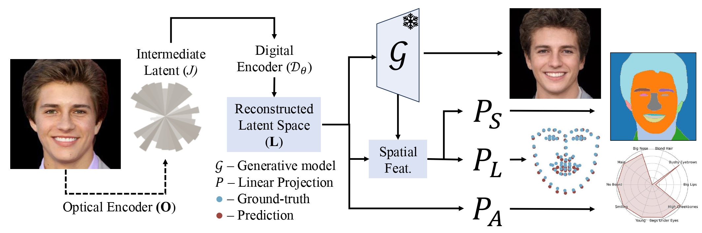

# Latent Space Imaging (CVPR 2025)
  <a href="https://arxiv.org/abs/2407.07052"></a>
  <a href="https://opensource.org/licenses/MIT"></a>

> Digital imaging systems have traditionally relied on brute-force measurement and processing of pixels arranged on regular grids. In contrast, the human visual system performs significant data reduction from the large number of photoreceptors to the optic nerve, effectively encoding visual information into a low-bandwidth latent space representation optimized for brain processing. Inspired by this, we propose a similar approach to advance artificial vision systems. Latent Space Imaging introduces a new paradigm that combines optics and software to encode image information directly into the semantically rich latent space of a generative model. This approach substantially reduces bandwidth and memory demands during image capture and enables a range of downstream tasks focused on the latent space. We validate this principle through an initial hardware prototype based on a single-pixel camera. By implementing an amplitude modulation scheme that encodes into the generative model's latent space, we achieve compression ratios ranging from 1:100 to 1:1000 during imaging, and up to 1:16384 for downstream applications. This approach leverages the model's intrinsic linear boundaries, demonstrating the potential of latent space imaging for highly efficient imaging hardware, adaptable future applications in high-speed imaging, and task-specific cameras with significantly reduced hardware complexity. 

<p align="center">

</p>

## Description   
Official Implementation of "<a href="https://arxiv.org/abs/2407.07052">Latent Space Imaging</a>" paper exploring the potential of imaging direct into the latent space of a generative model.

## Installation
- Clone the repository:
``` 
git clone https://github.com/vccimaging/latent-imaging.git
cd latent-imaging
```
- Dependencies:  
All dependencies defining the environment are provided in `lsi.yaml`.

### Inference Notebook
We provide two Jupyter notebooks `inference_real.ipynb` and `inference_simulation.ipynb` to reproduce the experimental and simulation paper results respectively.

### Pretrained Models
Please download the pre-trained models from the following links. We provide both the models and example input images to help you reproduce key results from the paper, with a particular focus on the real-world experimental setup.

| Path | Description
| :--- | :----------
|[Real 32](https://drive.google.com/file/d/1lsP9QNIY0YEk4sghJbAbr8Jk0K3eSHR9/view?usp=sharing)  | Real experimental setup 32 measurements.
|[Real 128](https://drive.google.com/file/d/1Gcl0YpzTS3IfO7qmIibqnne4cOgHf7JH/view?usp=sharing)  | Real experimental setup 128 measurements.
|[Simulation 256](https://drive.google.com/file/d/1YjpZo_Nen-dNfJXYCUiXuWaRR_5FWYOQ/view?usp=sharing)  | Simulated results 256 measurements.

The checkpoints should be placed in the `paper_checkpoints/` directory.

It is also necessary to download the pre-trained generative model StyleGANXL and the inversion model. Additionally, you will need IR-SE50 if you plan to train from scratch.

| Path | Description
| :--- | :----------
|[FFHQ StyleGANXL](https://drive.google.com/file/d/1snWFSv36KLThfNC6m7FUh6dGQGZiFhF5/view?usp=drive_link) | StyleGANXL model pretrained on FFHQ taken from the original repository [StyleGANXL](https://github.com/autonomousvision/stylegan-xl).
|[IR-SE50 Model](https://drive.google.com/file/d/1KW7bjndL3QG3sxBbZxreGHigcCCpsDgn/view?usp=sharing) | Pretrained IR-SE50 model taken from [TreB1eN](https://github.com/TreB1eN/InsightFace_Pytorch) for use in our ID loss during training.
|[Inversion Model StyleGANXL](https://drive.google.com/file/d/1snWFSv36KLThfNC6m7FUh6dGQGZiFhF5/view?usp=drive_link) | Trained inversion model for StyleGANXL model on FFHQ utilized as loss function.

The models should be placed in the `pretrained_models` directory.

## Training
After placing the `pretrained_models` correctly. You need to make sure that the datasets are also download and configured. In this work, we utilized mainly the FFHQ and CelebHQ at 256x256 resolution.
The CelebA-HQ dataset is accessible on [Progressive Growing of GANS](https://github.com/tkarras/progressive_growing_of_gans). The FFHQ dataset can be found at [FFHQ-Dataset](https://github.com/NVlabs/ffhq-dataset).

Later, the dataset paths should be added to `configs/paths_config.py` by updating the entries in the PATHS dictionary for 'ffhq', 'celeba_test', and 'celeba_train'.
In this work, the training set consists of FFHQ + CelebA-HQ (28k), and the test set contains 2k CelebA-HQ images.

The downstream applications (segmentation and landmarks) ground-truths are computed using **PyFacer**, a wrapper built on top of [FaRL](https://github.com/FacePerceiver/FaRL).


### **Training LSI**

The train script `run_o.sh` can be utilized with the arguments as described here:

```
python scripts/train.py \
--dataset_type ffhq_encode \
--exp_dir 00_training \
--val_interval 5000 \
--max_steps 150000 \
--workers 8 \
--batch_size 32 \
--test_batch_size 2 \
--test_workers 2 \
--learning_rate_mask 1e-4 \
--learning_rate 1e-4 \
--verbose True \
--ini_w ft \
--clip_w clamp \
--norm_w pass \
--bits 1 \
--encoder_lambda 1.0 \
--id_lambda 0.5 \
--lpips_lambda 0.0 \
--w_norm_lambda 0.0 \
--l2_lambda 1.0 \
--dino 0.1 \
--energy_loss_lambda 0.0 \
--energy_a 10 \
--energy_b 90 \
--generative_model styleganxl \
--quantizing_strategy detach \
--encoding_size 256 \
--encoding_size_out 512 \
--start_from_latent_avg \
--cls False \
--segment False \
--landmarks False \
```

This case illustrates training the model for reconstruction from scratch. The downstream application are trained seperately but sharing the same model. 


#### Loading and Finetuning
To load checkpoints you just need to add the `checkpoint_path` options for example
```--checkpoint_path ./paper_checkpoints/simulation_256.pt```.

This can be further utilized to finetune the model given real-world measurments from the experimental setup, as described in the paper. The `./datasets` folder contains different data files for reconstruction and downstream application, in the case of finetuning, the code should be adapted for the measured data and the flag `--ini_w` should be changed to **ft**.

## Acknowledgments
This code borrows heavily from [pixel2style2pixel](https://github.com/eladrich/pixel2style2pixel), [encoder4editing](https://github.com/omertov/encoder4editing/),[StyleGANXL](https://github.com/autonomousvision/stylegan-xl) and [DoesFS](https://github.com/zichongc/DoesFS).

## Citation
If this work was useful for you, please cite our paper <a href="https://arxiv.org/abs/2407.07052">Latent Space Imaging</a>:

```
@inproceedings{souza2025latent,
  title={Latent Space Imaging},
  author={Souza, Matheus and Zheng, Yidan and Kang, Kaizhang and Mishra, Yogeshwar Nath and Fu, Qiang and Heidrich, Wolfgang},
  booktitle={Proceedings of the Computer Vision and Pattern Recognition Conference},
  pages={28295--28305},
  year={2025}
}
```
